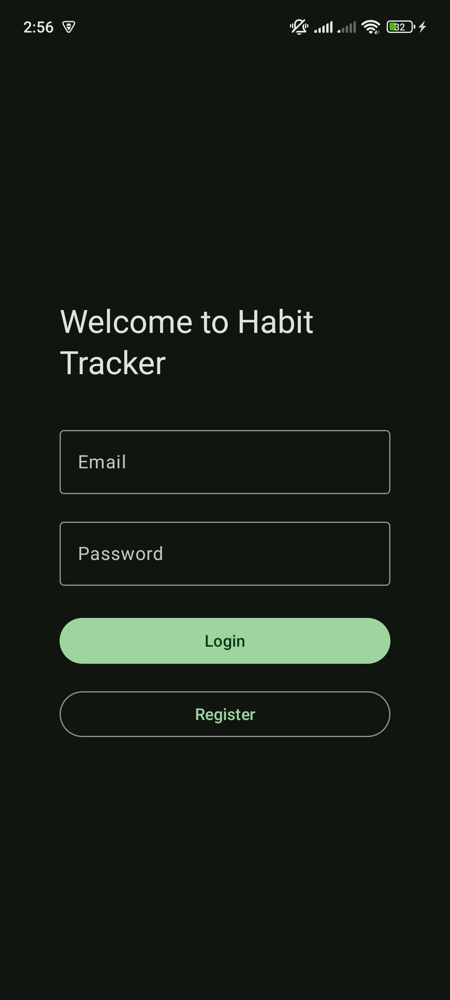
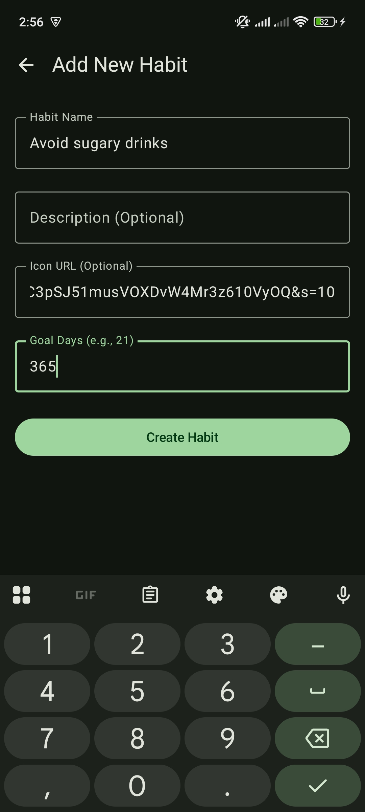
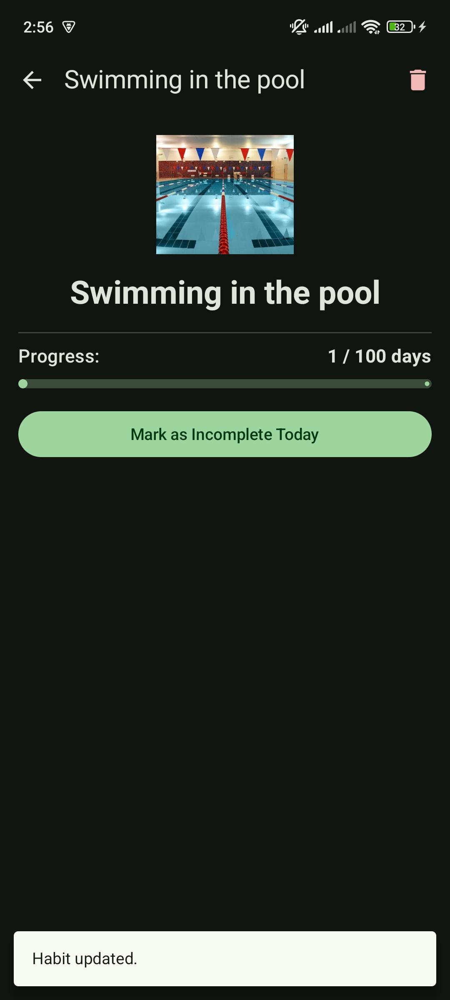

# 🌿 Habit Tracker App

A modern Android application for tracking daily habits, built to demonstrate **Clean Architecture** principles, **Modularization**, and modern Android development practices using **Jetpack Compose** and **Firebase**.

## 🎯 Project Goal
The main purpose of this project is to showcase a robust implementation of **Clean Architecture** with a multi-module setup. It separates concerns into three distinct layers (`Data`, `Domain`, `Presentation`) to ensure scalability, testability, and maintainability.

## ⚙️ Features
- **User Authentication:** Secure Login and Registration using Firebase Auth.
- **Habit Management:** Create, Read, Update, and Delete habits.
- **Progress Tracking:** Mark habits as completed for the day.
- **Daily Motivation:** Fetches motivational quotes from an external API using Retrofit.
- **Cloud Sync:** Real-time data synchronization using Cloud Database Firestore.

## 🏗️ Architecture
The project follows the Principles of Clean Architecture and is divided into modules:

1.  **📂 Domain Module** (Kotlin Library)
    - Contains Business Logic, Use Cases, and Domain Models.
    - Completely independent of Android frameworks or Data layers.
    - *Key components:* `UseCase`, `Repository Interface`, `Model`.

2.  **📂 Data Module** (Android Library)
    - Handles data operations and implements Domain interfaces.
    - Manages Firebase Firestore, Auth, and Network API calls.
    - *Key components:* `Repository Implementation`, `FirebaseDataSource`, `Retrofit API`, `DTOs`.

3.  **📂 Presentation Module** (Android App)
    - UI Logic and Screens.
    - Depends on Domain and DI.
    - *Key components:* `Activity`, `Composables`, `ViewModels`.

## 📸 Screenshots

| Login Screen | Home Screen | Add Habit | Habit Details | Habit Was Marked
|:---:|:---:|:---:|:---:|:---:|
|  |  |  |  |  |

## 🚀 Technologies Used

### Core
- Kotlin
- Coroutines & Flow

### UI & Presentation
- Jetpack Compose
- Material 3
- Coil

### Data & Networking
- Firebase Auth
- Cloud Firestore
- Retrofit

### Dependency Injection
- Dagger Hilt
