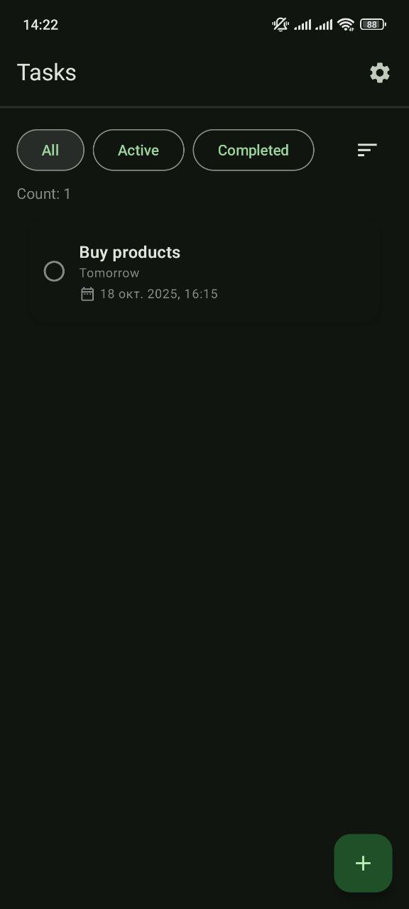
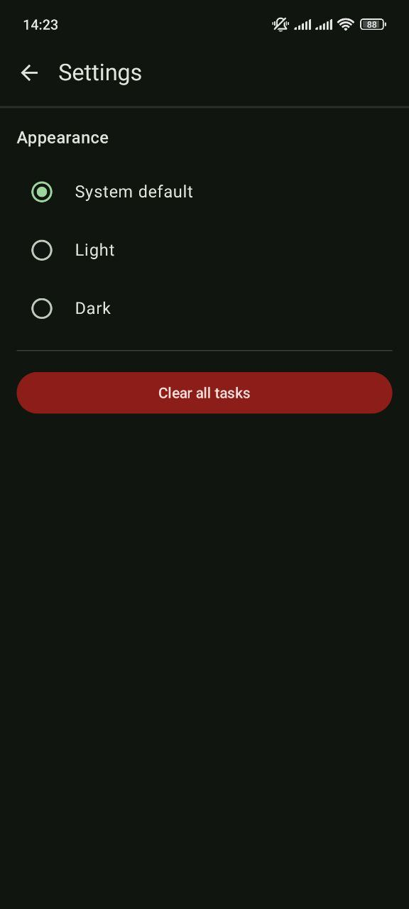
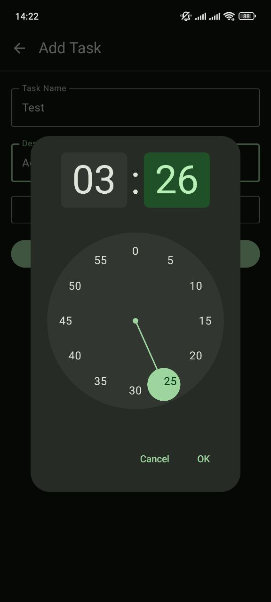
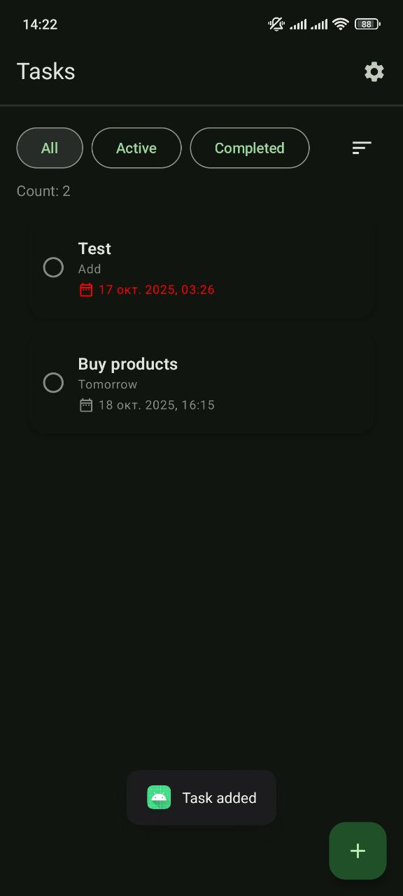
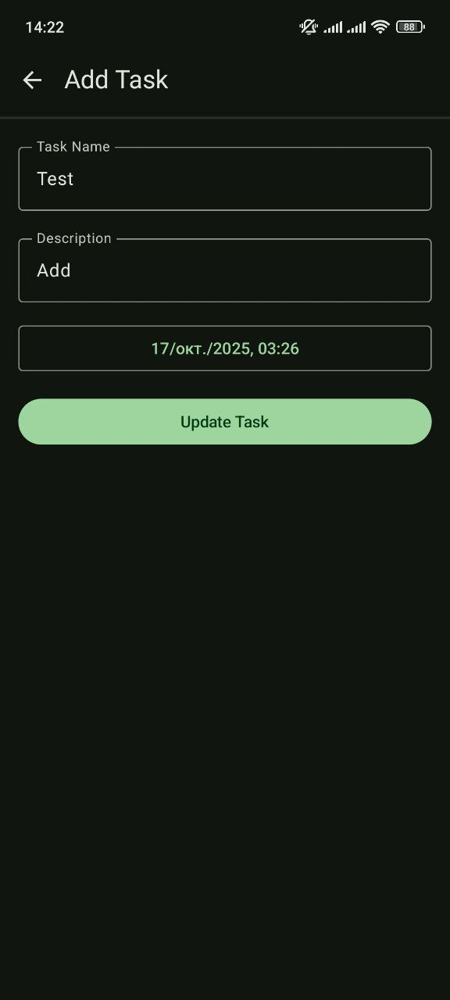

# 📝 Tasks App

A simple Android app for managing tasks (To-Do list), built using **Jetpack Compose**, **Room**, and **MVVM** architecture.

## ⚙️ Features
- Add, edit, and delete tasks  
- Sort tasks by title, due date, or creation date  
- Theme settings: Light, Dark, or System default  
- Persistent storage using Room database  
- Simple animation with AnimatedVisibility and SwipeToDismissBox

## 📸 Screenshots

| Main Screen | Add Task Screen | Settings Screen | Add Task with Due Date | Main Screen (Task Added) | Update Task |
|:-----------:|:---------------:|:---------------:|:----------------------:|:------------------------:|:-----------:|
|  |  |  |  |  |  |

## 🚀 Technologies Used
- Kotlin
- Jetpack Compose
- Room Database
- ViewModel / StateFlow
- Material 3